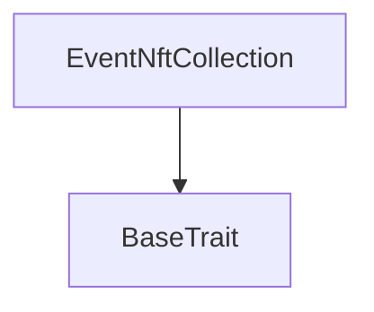
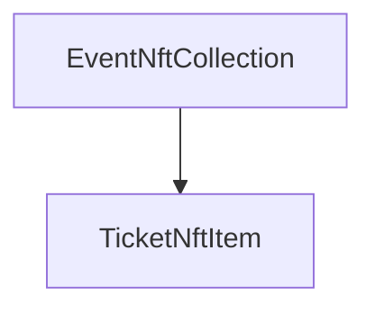

# TACT Compilation Report
Contract: EventNftCollection
BOC Size: 2092 bytes

# Types
Total Types: 30

## StateInit
TLB: `_ code:^cell data:^cell = StateInit`
Signature: `StateInit{code:^cell,data:^cell}`

## StdAddress
TLB: `_ workchain:int8 address:uint256 = StdAddress`
Signature: `StdAddress{workchain:int8,address:uint256}`

## VarAddress
TLB: `_ workchain:int32 address:^slice = VarAddress`
Signature: `VarAddress{workchain:int32,address:^slice}`

## Context
TLB: `_ bounced:bool sender:address value:int257 raw:^slice = Context`
Signature: `Context{bounced:bool,sender:address,value:int257,raw:^slice}`

## SendParameters
TLB: `_ bounce:bool to:address value:int257 mode:int257 body:Maybe ^cell code:Maybe ^cell data:Maybe ^cell = SendParameters`
Signature: `SendParameters{bounce:bool,to:address,value:int257,mode:int257,body:Maybe ^cell,code:Maybe ^cell,data:Maybe ^cell}`

## Deploy
TLB: `deploy#946a98b6 queryId:uint64 = Deploy`
Signature: `Deploy{queryId:uint64}`

## DeployOk
TLB: `deploy_ok#aff90f57 queryId:uint64 = DeployOk`
Signature: `DeployOk{queryId:uint64}`

## FactoryDeploy
TLB: `factory_deploy#6d0ff13b queryId:uint64 cashback:address = FactoryDeploy`
Signature: `FactoryDeploy{queryId:uint64,cashback:address}`

## CreateEventNftCollection
TLB: `create_event_nft_collection#c7dad7d1 event_id:uint64 organizer_address:address collection_content:^cell ticket_price:coins royalty_numerator:uint16 royalty_denominator:uint16 = CreateEventNftCollection`
Signature: `CreateEventNftCollection{event_id:uint64,organizer_address:address,collection_content:^cell,ticket_price:coins,royalty_numerator:uint16,royalty_denominator:uint16}`

## SetTicketPrice
TLB: `set_ticket_price#5e3a738f ticket_price:coins = SetTicketPrice`
Signature: `SetTicketPrice{ticket_price:coins}`

## Mint
TLB: `mint#b9e515a2 to:address individual_content:Maybe ^cell = Mint`
Signature: `Mint{to:address,individual_content:Maybe ^cell}`

## EventNftCollection$Data
TLB: `null`
Signature: `null`

## TicketNftItem$Data
TLB: `null`
Signature: `null`

## LogEventMintRecord
TLB: `log_event_mint_record#a3877d65 minter:address item_id:int257 generate_number:int257 = LogEventMintRecord`
Signature: `LogEventMintRecord{minter:address,item_id:int257,generate_number:int257}`

## GetRoyaltyParams
TLB: `get_royalty_params#693d3950 query_id:uint64 = GetRoyaltyParams`
Signature: `GetRoyaltyParams{query_id:uint64}`

## ReportRoyaltyParams
TLB: `report_royalty_params#a8cb00ad query_id:uint64 numerator:uint16 denominator:uint16 destination:address = ReportRoyaltyParams`
Signature: `ReportRoyaltyParams{query_id:uint64,numerator:uint16,denominator:uint16,destination:address}`

## CollectionData
TLB: `_ next_item_index:int257 collection_content:^cell owner_address:address = CollectionData`
Signature: `CollectionData{next_item_index:int257,collection_content:^cell,owner_address:address}`

## RoyaltyParams
TLB: `_ numerator:int257 denominator:int257 destination:address = RoyaltyParams`
Signature: `RoyaltyParams{numerator:int257,denominator:int257,destination:address}`

## Transfer
TLB: `transfer#5fcc3d14 query_id:uint64 new_owner:address response_destination:Maybe address custom_payload:Maybe ^cell forward_amount:coins forward_payload:remainder<slice> = Transfer`
Signature: `Transfer{query_id:uint64,new_owner:address,response_destination:Maybe address,custom_payload:Maybe ^cell,forward_amount:coins,forward_payload:remainder<slice>}`

## OwnershipAssigned
TLB: `ownership_assigned#05138d91 query_id:uint64 prev_owner:address forward_payload:remainder<slice> = OwnershipAssigned`
Signature: `OwnershipAssigned{query_id:uint64,prev_owner:address,forward_payload:remainder<slice>}`

## Excesses
TLB: `excesses#d53276db query_id:uint64 = Excesses`
Signature: `Excesses{query_id:uint64}`

## GetStaticData
TLB: `get_static_data#2fcb26a2 query_id:uint64 = GetStaticData`
Signature: `GetStaticData{query_id:uint64}`

## ReportStaticData
TLB: `report_static_data#8b771735 query_id:uint64 index_id:int257 collection:address = ReportStaticData`
Signature: `ReportStaticData{query_id:uint64,index_id:int257,collection:address}`

## GetNftData
TLB: `_ is_initialized:bool index:int257 collection_address:address owner_address:address individual_content:^cell = GetNftData`
Signature: `GetNftData{is_initialized:bool,index:int257,collection_address:address,owner_address:address,individual_content:^cell}`

## CreateEvent
TLB: `create_event#2c3f4643 organizer_address:address ticket_price:coins event_content:^cell = CreateEvent`
Signature: `CreateEvent{organizer_address:address,ticket_price:coins,event_content:^cell}`

## SetRoyaltyNumerator
TLB: `set_royalty_numerator#4ceff002 royalty_numerator:uint16 = SetRoyaltyNumerator`
Signature: `SetRoyaltyNumerator{royalty_numerator:uint16}`

## SetEventCreationFee
TLB: `set_event_creation_fee#1dea23be event_creation_fee:coins = SetEventCreationFee`
Signature: `SetEventCreationFee{event_creation_fee:coins}`

## TransferOwnership
TLB: `transfer_ownership#7de2376d new_tona_owner_address:address = TransferOwnership`
Signature: `TransferOwnership{new_tona_owner_address:address}`

## TonAState
TLB: `_ tona_event_tickets_type:uint64 tona_owner_address:address total_events:uint64 event_creation_fee:coins royalty_numerator:uint16 royalty_denominator:uint16 = TonAState`
Signature: `TonAState{tona_event_tickets_type:uint64,tona_owner_address:address,total_events:uint64,event_creation_fee:coins,royalty_numerator:uint16,royalty_denominator:uint16}`

## TonA$Data
TLB: `null`
Signature: `null`

# Get Methods
Total Get Methods: 6

## get_collection_data

## get_nft_address_by_index
Argument: item_index

## getTicketNftItemInit
Argument: item_index

## get_nft_content
Argument: index
Argument: individual_content

## royalty_params

## mint_fee

# Error Codes
2: Stack underflow
3: Stack overflow
4: Integer overflow
5: Integer out of expected range
6: Invalid opcode
7: Type check error
8: Cell overflow
9: Cell underflow
10: Dictionary error
11: 'Unknown' error
12: Fatal error
13: Out of gas error
14: Virtualization error
32: Action list is invalid
33: Action list is too long
34: Action is invalid or not supported
35: Invalid source address in outbound message
36: Invalid destination address in outbound message
37: Not enough TON
38: Not enough extra-currencies
39: Outbound message does not fit into a cell after rewriting
40: Cannot process a message
41: Library reference is null
42: Library change action error
43: Exceeded maximum number of cells in the library or the maximum depth of the Merkle tree
50: Account state size exceeded limits
128: Null reference exception
129: Invalid serialization prefix
130: Invalid incoming message
131: Constraints error
132: Access denied
133: Contract stopped
134: Invalid argument
135: Code of a contract was not found
136: Invalid address
137: Masterchain support is not enabled for this contract
2683: insufficient funds for ticket price
18909: not organizer
20106: Insufficient funds for event creation fee
24717: not tona
27499: initialized tx need from collection
40056: not tona owner
49280: not owner
49469: not from collection
62134: royalty numerator exceeds max
62742: non-sequential NFTs

# Trait Inheritance Diagram

# Contract Dependency Diagram

